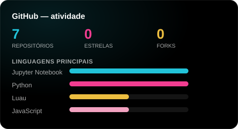
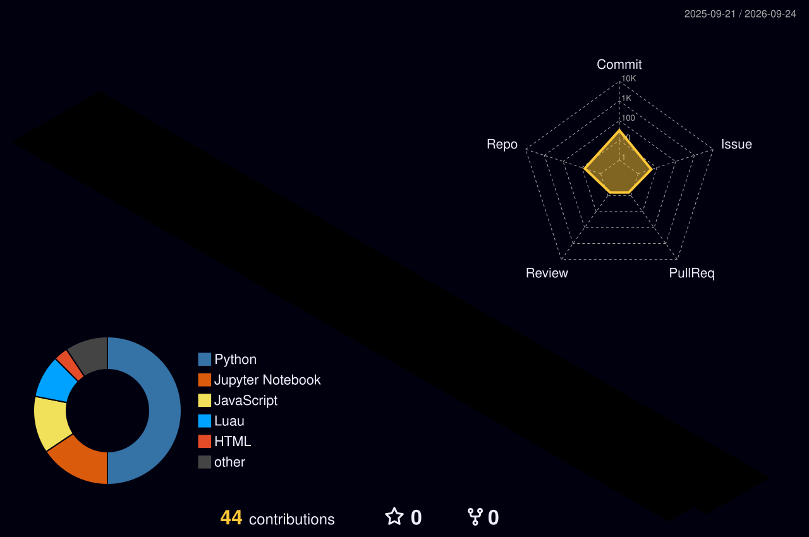
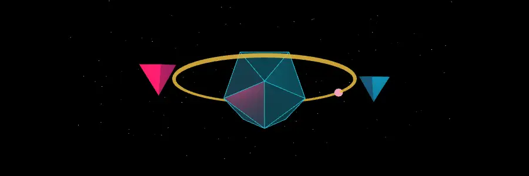
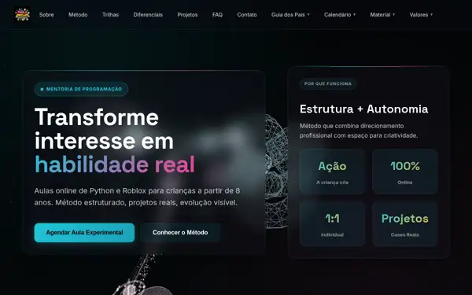

<a href="https://paulapeclat.com.br"><strong>→ paulapeclat.com.br</strong></a> ·
<a href="https://instagram.com/paulapeclat.oficial"><strong>@paulapeclat.oficial</strong></a>

  

<a href="README.md">🇧🇷 Português</a> · 🇺🇸 **English**

 

### 🔭 What I do

**Research** — Master's in Education (PPGEduc/UFRRJ, Brazil), advised by Prof. Dr. Anelise Monteiro do Nascimento. I work at the intersection of **media education**, **media literacy**, childhoods and technology: I study digital childhoods through the lens of the Sociology of Childhood (Corsaro, Sarmento), treating children as producers of culture — not passive media consumers.

**Teaching** — Founder of [APedê Digital](https://paulapeclat.com.br), a technology education platform for children, with students from all 27 Brazilian states and abroad. Curriculum in Python, Roblox/Luau, GDevelop and microStudio, progressing from concrete to abstract.

**Projects** — Tools that bridge research and practice: educational scripts, classroom simulators, game data analysis.

 

### 🧠 Research interests

 

### 🎮 The Trail

 
generated from <code>data/trilha.json</code> — every new milestone is one line of JSON

 

### 🧭 Star Expedition — play now

Anyone can move the explorer! Click an arrow, submit the pre-filled issue, and a bot processes your move in ~30 seconds. Collect the ⭐! (the bot replies in Portuguese 🇧🇷)

<table>
<tr>
<td></td>
<td align="center"><a href="https://github.com/paulapeclat/paulapeclat/issues/new?title=expedicao%7Cmover%7Cnorte&body=Just%20click%20%22Create%22%20%E2%80%94%20the%20bot%20processes%20your%20move%20and%20closes%20this%20issue%20automatically%21%20%F0%9F%9A%80">⬆️ <strong>north</strong></a></td>
<td></td>
</tr>
<tr>
<td align="center"><a href="https://github.com/paulapeclat/paulapeclat/issues/new?title=expedicao%7Cmover%7Coeste&body=Just%20click%20%22Create%22%20%E2%80%94%20the%20bot%20processes%20your%20move%20and%20closes%20this%20issue%20automatically%21%20%F0%9F%9A%80">⬅️ <strong>west</strong></a></td>
<td></td>
<td align="center"><a href="https://github.com/paulapeclat/paulapeclat/issues/new?title=expedicao%7Cmover%7Cleste&body=Just%20click%20%22Create%22%20%E2%80%94%20the%20bot%20processes%20your%20move%20and%20closes%20this%20issue%20automatically%21%20%F0%9F%9A%80"><strong>east</strong> ➡️</a></td>
</tr>
<tr>
<td></td>
<td align="center"><a href="https://github.com/paulapeclat/paulapeclat/issues/new?title=expedicao%7Cmover%7Csul&body=Just%20click%20%22Create%22%20%E2%80%94%20the%20bot%20processes%20your%20move%20and%20closes%20this%20issue%20automatically%21%20%F0%9F%9A%80">⬇️ <strong>south</strong></a></td>
<td></td>
</tr>
</table>

the board may take a few minutes to refresh due to GitHub's image cache

 

### 📌 Now

<!--STATUS-START-->
🟢 Finishing my master's qualifying exam
<!--STATUS-END-->

(this line updates automatically — see `scripts/update_status.py`)

 

### ✨ Resource of the day — media education

<!--RECURSO-START-->
🎯 **[Comunicar](https://www.revistacomunicar.com)** — Revista ibero-americana de comunicação e educação, indexada internacionalmente. (PT)
<!--RECURSO-END-->

one new resource every day, straight from my curated list <a href="https://github.com/paulapeclat/awesome-educacao-midiatica">awesome-educacao-midiatica</a> ⭐

 

### 🗺️ Reach Map

 
generated from <code>data/alcance.json</code> — outlines projected from real geographic coordinates

 

### 🕹️ Player Card

&nbsp;

 

### 🛠️ Tools & technologies

**Game and app creation — concrete to abstract, in the order I teach**

**Languages & code**

**AI & automation**

**Media & communication**

 

### 🌆 Contributions in 3D

 

### 🪐 3D Objects

Three.js scene rendered automatically by <code>scripts/render-3d-hero.js</code> — perfect loop, no JavaScript in the README

 

### 🌐 See it in 3D

 
Preview generated automatically from paulapeclat.com.br

 

### 📚 Methodology

- **Child-centered** — I listen, observe and build from children's own curiosities
- **Practice-reflective** — Theory informing practice; practice generating new data
- **Progressive** — From concrete to abstract, from playful to formal
- **Collaborative** — An open space for building together

 

### 💼 Open to collaboration

I'm open to:
- **Research** in media education, media literacy, digital childhoods, technology education, educational game design
- **Teaching** through workshops, courses and project mentoring
- **Development** of educational tools and pedagogical simulators
- **Consulting** on education policy for the digital context

 

### 📫 Contact & links

---

Gamified profile, updated automatically — see <a href="https://github.com/paulapeclat/paulapeclat/tree/main/scripts">scripts</a> and <a href="https://github.com/paulapeclat/paulapeclat/tree/main/.github/workflows">workflows</a> · <a href="README.md">🇧🇷 versão em português</a>

